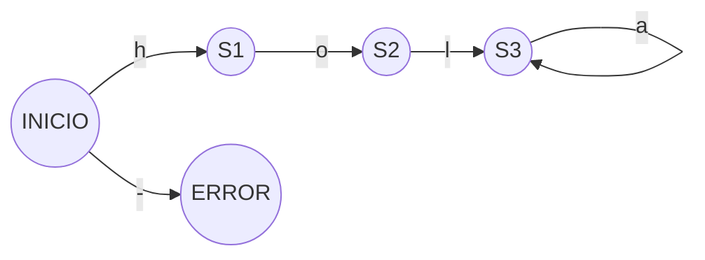

# Automata c++

Automata que reconozca la palabra  **hola**. 

Tutorial:
[Youtube Programando Con Pablo](https://www.youtube.com/channel/UC4kQg80cyA7VHEV4VGKwtEA)

[Contacto directo instagram ](https://www.instagram.com/pablosalazzar/)

## Diagrama

